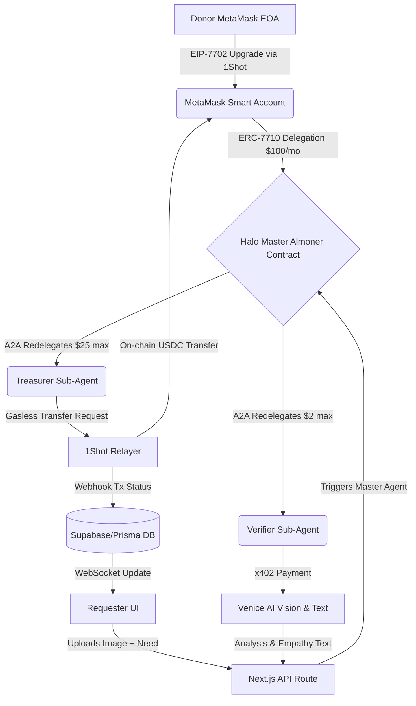

Here is the complete, meticulous blueprint to build **Halo – The Programmable Mutual Aid Fund**. This document is structured as a technical specification and execution plan, bridging empathetic product design with hyper-advanced, surgical web3 engineering.

---

# HALO: Execution Blueprint

## PART 1: The "ART" (UX, UI & Demo Strategy)

### 1. Visual Identity & Design Language

Halo is an anti-bureaucracy tool. It must not look like a sterile DeFi dashboard. It should feel like a secure, modern chat application (like WhatsApp or Signal) crossed with a premium consumer fintech app.

- **Palette:** "Warm Minimalism."
  - Background: Soft Ivory (`#FAF9F6`)
  - Primary Action: Deep Sage Green (`#4A5D23`) – conveys growth, safety, and money.
  - Accents: Warm Coral (`#E07A5F`) – for alerts and emphasis.
  - Text: Charcoal (`#2B2B2B`).
- **Typography:** _Inter_ for UI components (clean, legible), _Playfair Display_ for empathetic headers.
- **UI Framework:** Next.js 15 App Router, TailwindCSS, `shadcn/ui` (heavily customized to remove hard borders, adding soft shadows and rounded corners `rounded-2xl`).

### 2. Core UI Components

- **`DonorOnboardingCard`**: A 1-click Apple Pay-style modal for EOA-to-Smart Account upgrade (7702) and allowance delegation (7710/7715).
- **`RequestChatInterface`**: The primary view for Requesters. A chat feed where they upload an image of a receipt and type their need.
- **`HaloLiveFeed`**: A marquee/feed showing anonymous, successful grants updated in real-time via 1Shot Webhooks (e.g., _"Someone in Lagos received $30 for baby formula."_).

### 3. The Winning Demo Script (3 Minutes, No Filler)

_The setup: Screen is split 60/40. Left side is the beautiful Halo UI. Right side is a black terminal tailing the backend logs. This contrast proves the tech._

- **[0:00 - 0:30] The Onboarding (1Shot & MetaMask)**
  - **UI:** User connects a fresh MetaMask EOA. Clicks "Sponsor $100/mo".
  - **Terminal:** Logs light up: `[EIP-7702] Upgrading EOA 0x... to Smart Account via 1Shot Relayer... SUCCESS`. `[ERC-7710] Advanced Permission signed. Master Almoner authorized for 100 USDC.`
- **[0:30 - 1:15] The Request & A2A Coordination**
  - **UI:** Switch to Requester view. User types: _"I need $25 for this asthma inhaler"_ and uploads a photo of a pharmacy receipt.
  - **Terminal:** `[A2A] Master Agent waking... Redelegating authority...`
  - **Terminal:** `[ERC-7710] Sub-delegation: VerifierAgent authorized for $2.00 (Inference).`
  - **Terminal:** `[ERC-7710] Sub-delegation: TreasurerAgent authorized for $25.00 (Payout).`
- **[1:15 - 2:00] The Verification (Venice AI & x402)**
  - **Terminal:** `[VENICE] Requesting Vision API for image analysis...`
  - **Terminal (The Money Shot):** `[HTTP 402] Payment Required. Intercepting x402 Invoice...`
  - **Terminal:** `[x402] VerifierAgent signing micro-tx using delegated allowance... Payment Success.`
  - **Terminal:** `[VENICE] Vision confirmed receipt validity. Requesting Text API for empathetic response...`
- **[2:00 - 2:40] The Payout & Webhooks (1Shot)**
  - **Terminal:** `[TREASURER] Executing $25 USDC transfer to Requester via 1Shot Relayer...`
  - **Terminal:** `[1Shot] Webhook received: tx_success. Hash: 0x...`
- **[2:40 - 3:00] The Payoff**
  - **UI:** The chat interface bubbles up an incoming message from the Halo Agent: _"Breathe easy. We've verified your prescription and sent $25 to your wallet. You are cared for."_ The `HaloLiveFeed` updates simultaneously.

---

## PART 2: The "SCIENCE" (Architecture & Smart Contracts)

### 1. Mermaid Architecture Diagram



### 2. Smart Contract Architecture (Foundry)

You need three core contracts representing your "Agent Swarm."

1.  **`HaloAlmoner.sol` (Master Agent):** The primary recipient of the ERC-7715 Advanced Permission from the user. It holds the logic to verify a requester request and spin up sub-delegations.
2.  **`HaloVerifier.sol`:** Holds the specific logic to sign L2 micro-transactions to pay x402 Venice invoices.
3.  **`HaloTreasurer.sol`:** Constructs the `userOp` or payload for the 1Shot Relayer to move the USDC.

**The Delegation Flow & Parameters:**

- **Delegation 1 (User -> Master):** `caveats: [ { type: 'ERC20SpendLimit', token: USDC_ADDR, limit: 100e6, period: 30 days } ]`
- **Redelegation A (Master -> Verifier):** `caveats: [ { type: 'ERC20SpendLimit', token: USDC_ADDR, limit: 2e6, period: 1 day }, { type: 'TargetRestriction', target: VENICE_PAYMASTER } ]`
- **Redelegation B (Master -> Treasurer):** `caveats: [ { type: 'ERC20SpendLimit', token: USDC_ADDR, limit: 25e6, period: 1 hour }, { type: 'TargetRestriction', target: REQUESTER_ADDR } ]`

### 3. Database Schema (Prisma)

```prisma
model User {
  id            String   @id @default(cuid())
  address       String   @unique
  isSmartWallet Boolean  @default(false)
  role          Role     // DONOR, REQUESTER
  delegations   Delegation[]
  grants        Grant[]
}

model Delegation {
  id          String   @id @default(cuid())
  donorId     String
  user        User     @relation(fields: [donorId], references: [id])
  allowance   Float
  spent       Float    @default(0)
  signature   String   // The ERC-7715 delegation signature
  expiresAt   DateTime
}

model Grant {
  id          String   @id @default(cuid())
  requesterId String
  user        User     @relation(fields: [requesterId], references: [id])
  amount      Float
  status      GrantStatus // PENDING, VERIFYING, APPROVED, REJECTED, PAID
  imageUrl    String
  aiReasoning String?
  txHash      String?
}
```

---

## PART 3: Implementation Logic (Agents, Venice, 1Shot)

### 1. Verifier Agent Logic (Venice + x402 + Anti-Spam)

- **Anti-Spam:** When an image is uploaded, hash the image file (`crypto.createHash('sha256')`). Check the DB to ensure this receipt hasn't been uploaded before. Rate limit: 1 request per wallet per week.
- **Venice Vision:** Prompt: `Analyze this receipt. Does it show a purchase related to [USER NEED]? Extract the total amount. Reply strictly in JSON: { "valid": boolean, "extracted_amount": number, "category": string }`
- **x402 Flow (`lib/x402.ts`):**
  1. Agent makes standard `fetch` to Venice endpoint.
  2. Catches `HTTP 402`. Parses the `L402` header to extract the invoice and macaroon.
  3. Agent uses the `HaloVerifier` redelegated signature to construct a payment transaction to the Venice paymaster.
  4. Resubmits the `fetch` with the `Authorization: L402 <macaroon>:<preimage>` header.
- **Venice Text:** If `valid: true`, Agent makes a second x402-paid call to Venice Text. Prompt: `Write a 2-sentence, warm, encouraging message to a person who just received a mutual aid grant for [USER NEED].`

### 2. Treasurer Agent Logic (1Shot Relayer & Webhooks)

- Once Verifier approves, the Treasurer Agent constructs the transaction payload.
- **1Shot API Call:** Use the `relayer_send7710Transaction` endpoint.
  - Set `feeToken` to USDC (Gas Abstraction).
  - Pass the ERC-7710 `delegationChain` (User -> Master -> Treasurer).
  - Target: USDC Contract. Data: `transfer(requester, 25e6)`.
- **Webhook Listener (`app/api/webhooks/1shot/route.ts`):**
  - Listen for `POST`. Verify 1Shot signature.
  - On `status: success`, update `Grant` table `status = PAID` and `txHash`.
  - Trigger Supabase Realtime / WebSocket to update the frontend UI.

---

## PART 4: File-by-File Directory Structure

```text
halo-mutual-aid/
├── contracts/                        # Foundry Project
│   ├── src/
│   │   ├── HaloAlmoner.sol           # Master Agent Contract
│   │   ├── HaloVerifier.sol          # Sub-Agent (Inference permissions)
│   │   └── HaloTreasurer.sol         # Sub-Agent (Transfer permissions)
│   ├── script/DeployHalo.s.sol
│   └── test/HaloAgents.t.sol
├── app/                              # Next.js 15 App
│   ├── layout.tsx
│   ├── page.tsx                      # Landing / EOA Connect
│   ├── donor/page.tsx                # Donor Dashboard & Delegation
│   ├── request/page.tsx              # Chat Interface for Requesters
│   ├── api/
│   │   ├── request/route.ts          # Handles image upload & kicks off Master Agent
│   │   ├── agent/verify/route.ts     # Verifier Agent (Venice + x402)
│   │   ├── agent/payout/route.ts     # Treasurer Agent (1Shot payout)
│   │   └── webhooks/1shot/route.ts   # 1Shot tx status updates
├── components/
│   ├── ui/                           # shadcn components (button, card, dialog)
│   ├── ChatBubble.tsx
│   ├── LiveFeedMarquee.tsx
│   └── DelegationModal.tsx
├── lib/
│   ├── viem.ts                       # Smart Account Kit config
│   ├── venice.ts                     # Venice AI SDK wrapper
│   ├── x402.ts                       # x402 payment interceptor/solver
│   └── 1shot.ts                      # 1Shot Relayer REST API wrapper
├── prisma/
│   └── schema.prisma                 # Database schema
├── .env.local
└── tailwind.config.ts
```

---

## PART 5: Hackathon Track Alignment Matrix

| Track                     | Prize | How Halo Satisfies It                                                                                                                           |
| :------------------------ | :---- | :---------------------------------------------------------------------------------------------------------------------------------------------- |
| **Best Agent**            | $3k   | AI Agent operates autonomously in the background, making verification & payout decisions using Smart Accounts.                                  |
| **Best x402+7710**        | $3k   | Verifier Agent pays Venice APIs dynamically using `L402` protocol, funded by ERC-7710 delegated allowances (not direct EOA signatures).         |
| **Best A2A Coordination** | $3k   | Master Agent explicitly **redelegates** specific caveats (Inference vs. Payout) to Verifier and Treasurer sub-agents.                           |
| **Best Use of Venice AI** | $3k   | Uses Venice multimodally: **Vision** (receipt OCR & spam check) and **Text** (empathy generation), deeply integrated into the app's core logic. |
| **Best Use of 1Shot**     | $1k   | Upgrades Donors using **EIP-7702** via 1Shot. Relays all USDC payouts via 1Shot, paying gas in stablecoins. Updates UI via **1Shot Webhooks**.  |

---

## PART 6: Testing & Deployment Plan

### 1. Smart Contract Testing (Foundry)

- **Test 1:** Verify EIP-7702 upgrade mapping.
- **Test 2:** Assert that `HaloVerifier` cannot call `transfer()` on USDC (proving the caveat restrictions of redelegation work).
- **Test 3:** Assert that `HaloTreasurer` cannot spend more than the $30 per-tx limit set by the delegation caveat.

### 2. Testnet Deployment (Base Sepolia)

Base Sepolia is the ideal target because it has strong support for Account Abstraction, EIP-7702, and cheap gas for testing.

1.  Deploy contracts using `forge script script/DeployHalo.s.sol --rpc-url $BASE_SEPOLIA_RPC --broadcast`.
2.  Fund a mock Paymaster on Base Sepolia to simulate the x402 settlement layer.
3.  Deploy a mock USDC ERC20 token for testing the Treasurer Agent.

### 3. Local Webhook Testing

- Use `ngrok` or `localtunnel` to expose your `localhost:3000/api/webhooks/1shot` to the internet.
- Register the `ngrok` URL in the 1Shot Developer Dashboard to ensure your UI updates during local testing.

### 4. x402 Testing

- Venice provides a sandbox/testnet endpoint for x402. Hardcode a mock `L402` header interceptor in `lib/x402.ts` during local development to ensure your viem signing logic works before spending real testnet funds.

---

**Architect's Final Note:**
Do not waste time making the Next.js app 50 pages deep. You only need three screens: Home, Donor, Requester. Spend 80% of your time perfecting the **terminal logging and the seamless A2A handoff** between 7710 and 1Shot. The split-screen demo of human UI vs. Agentic Terminal is what will win the $13,000. Start with the Foundry contracts today.
