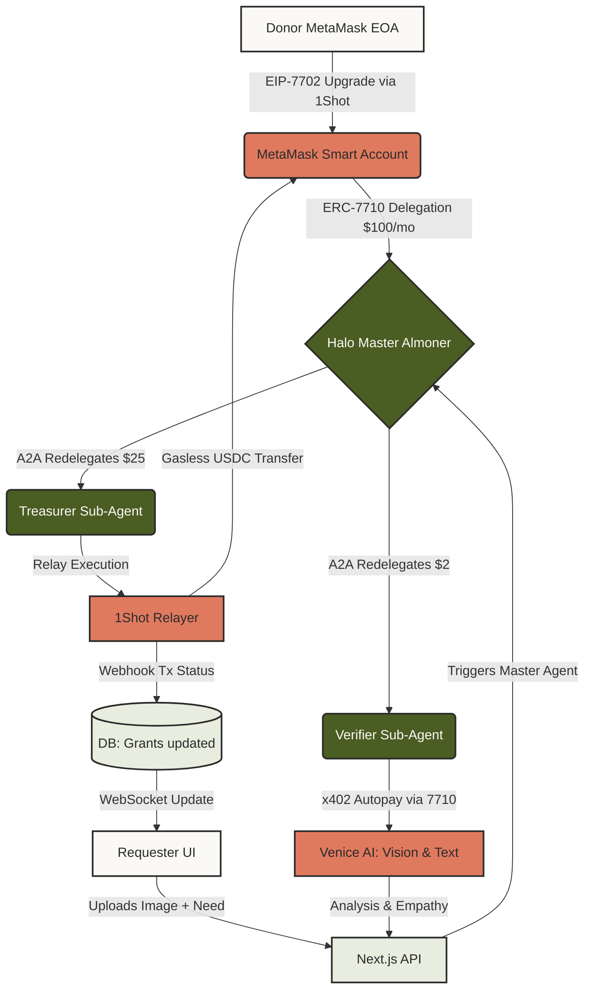

I checked [JOURNEY_X_VIDEOS_PLAN.md](/Users/apple/HALO/docs/JOURNEY_X_VIDEOS_PLAN.md:1). The X journaling plan is good, but I’d tighten it: post consistently, but never overclaim. For Step 1, we can say the Foundry contract baseline and redelegation caveat logic are passing; we should not imply MetaMask/1Shot/Venice are already integrated.

I also verified the HackQuest page: the social track rewards frequent, clear project-journey posts, requires tagging `@MetaMaskDev`, and specifically wants you to show how Advanced Permissions improve UX. Source: [HackQuest Cook Off page](https://www.hackquest.io/hackathons/MetaMask-Smart-Accounts-Kit-x-1Shot-API-x-Venice-AI-Dev-Cook-Off).

**The Hook**

For May 31, 2026, I’d post this:

```text
Building Halo for the @MetaMaskDev x @1ShotAPI x @AskVenice Cook Off.

Halo is an autonomous mutual aid fund: donors grant a scoped allowance with MetaMask Advanced Permissions, then AI sub-agents verify urgent requests and route USDC without taking custody.

Step 1 is live: Foundry scaffold + Master Almoner caveat tests passing.

#BuildInPublic
```

Use a screenshot of either:

- the architecture diagram from `docs/BLUEPRINT.md`, best for first impression, or
- the green terminal test output, best for proof-of-work.

Best move: architecture image as the main post, terminal recording as a reply underneath.

**Screen Recording**

I added a reusable helper:

```bash
scripts/record_step1_terminal.sh
```

Use it like this:

1. Open Terminal at `/Users/apple/HALO`.
2. Increase font size with `Cmd` + `+` until text is readable.
3. Press `Cmd` + `Shift` + `5`.
4. Choose “Record Selected Portion” and crop tightly around the terminal.
5. Run:

```bash
scripts/record_step1_terminal.sh
```

It prints judge-readable logs, runs `forge fmt --check`, then runs:

```bash
forge test --match-contract HaloAlmonerTest -vvv
```

I verified the helper: it passes and shows `10 passed; 0 failed; 0 skipped`.

For future steps, I can keep adding matching `record_stepN_terminal.sh` scripts so every build milestone has a clean proof clip.

#######

You are exactly right. Mermaid _is_ just plain text code—that is its superpower for documentation, but you can't post plain text code as an image on X!

To get the beautiful visual diagram for your post, you need to render it. Here is the surgical way to do it in 30 seconds:

### How to turn the Mermaid code into an Image:

1. Copy the exact text block below.
2. Go to **[mermaid.live](https://mermaid.live/)** in your browser.
3. Paste the text into the **"Code"** section on the left side of the screen.
4. The diagram will instantly render on the right.
5. In the "Actions" section on the bottom left, click **"Download PNG"** (or just take a screenshot of the rendered image).

Here is the code to copy:



_(Note: I added custom styling colors to this version using your UI palette—Sage Green, Warm Coral, and Ivory. It will look incredibly premium on X)._

---

Generate that image, make your post, and record your Step 2 terminal tests.

Once you are ready to wire the smart contracts to the Next.js backend, hit me with the answer to the **Step 3 Checkpoint Question**:

_When the Verifier Agent calls the `send7710Transaction` function (via 1Shot) to pay Venice AI, what string will be passed as the `targetContract` variable?_

##

**Feedback Note Candidate**

This is not a normal X build update. It fits the HackQuest **Best Feedback** angle.

Use it later when you want to show that you are not only building, but also giving useful builder feedback about the ecosystem. It should answer: “What did building with these tools teach you, and what could help future builders?”

Example use:

```text
Builder feedback from Halo Step 5:

The most important integration boundary was keeping token amounts as bigint internally, then serializing to hex only at the wallet/RPC edge.

That made MetaMask permission payloads easier to audit and caught one bug before live relayer work.
```

Post it after Step 5 or Step 6, not before. It is stronger once you have both MetaMask permission request and 1Shot redemption proof.

**HackQuest Checkpoints**

On the HackQuest project page:

1. Open your Halo project.
2. Go to the **Checkpoints** tab.
3. Click **Add Checkpoint**.
4. Choose type: **Development**.
5. Add the title and description.
6. Add a link if available, usually your X post URL.
7. Post/save it.

For Step 3:

```text
Title:
Backend relay draft bridge

Description:
Added tested backend bridge that converts Verifier/Treasurer intents into 1Shot ERC-7710 relay request drafts. 5 backend tests passing.
```

Link:
Use your Step 3 X reply/post after you publish it.

For Step 5:

```text
Title:
MetaMask permission request

Description:
Wired donor UI for MetaMask Smart Accounts Kit requestExecutionPermissions using a scoped USDC periodic permission. 9 backend tests passing.
```

Link:
Use your Step 5 X post URL.

You don’t need a checkpoint for every single step. Step 3 and Step 5 are good because they show meaningful integration progress: backend relay bridge, then MetaMask Advanced Permissions.

##

Yes. GO on in-between posts, but keep them proof-based.

HackQuest’s social track says they reward builders who share the journey online, tag `@MetaMaskDev`, and show how Advanced Permissions improved UX / streamlined user permissions. Judging looks at clarity, relevance, engagement, and frequency/consistency. Source: [HackQuest Cook Off page](https://www.hackquest.io/hackathons/MetaMask-Smart-Accounts-Kit-x-1Shot-API-x-Venice-AI-Dev-Cook-Off).

**Best In-Between Posts**

1. **Step proof posts**
   - “Step 5: MetaMask Advanced Permission request wired.”
   - Include terminal test recording + short UI clip if possible.
   - Say clearly: permission request wired, 1Shot redemption comes next.

2. **Architecture clarification posts**
   - Example: “Important distinction: Halo does not custody donor funds. The donor signs a scoped permission; agents redeem only within caveats.”
   - These are good because judges may care about whether you understand the model.

3. **Bug / lesson notes**
   - Good if framed as engineering rigor.
   - Example: “Caught a permission amount serialization issue in tests before wallet flow. BigInt in app state, hex quantity at RPC boundary.”
   - Don’t make bugs the headline too often.

4. **UX comparison posts**
   - This is especially relevant because the social criteria mentions Advanced Permissions streamlining UX.
   - Example: “Traditional flow: donor signs every payout. Halo flow: one scoped permission, then agents act within limits.”

5. **Checkpoint posts on HackQuest**
   - Add major milestones there too: Step 5 permission wiring, Step 6 1Shot redemption, Step 7 Venice/x402.
   - Keep them short and factual.

6. **Feedback note**
   - There is also a HackQuest “Best Feedback” prize. A thoughtful note about documentation friction, API shape, or what was smooth/difficult could help.

I’d do one post per meaningful milestone, not daily filler. For now, Step 5 deserves a post because it is the first real MetaMask Advanced Permissions UX proof.

####

**Verdict: CONDITIONAL GO.**

The content is right for judges: donor allowance caps, MetaMask permission flow, no-custody language, requester UX, local logs, and Step 5/6 proof signals. But I would **not post these raw screenshots as-is**.

Main issues:

- Image 1 has the fullscreen `esc` overlay. Retake.
- Browser chrome/tabs are visible. Crop them out for public posts.
- The bottom-right screenshot thumbnail appears in images 2-4. Retake after waiting a second, or crop it out.
- The `Step 6 1Shot` pill may confuse a Step 4/5 post. Either crop it out or caption clearly says this is the current UI after Step 6 backend alignment.

Best posting format:

- **Step 4 post:** one clean `/request` or `/donor` full-app screenshot showing the app shell and logs. Screenshot is enough.
- **Step 5 post:** use a short screen recording or focused screenshot of the donor permission panel: agent session account, Base Sepolia, $100 allowance, Request permission button, and security note.
- **HackQuest images:** use clean 1280x720 cropped images, no browser tabs. Good set: architecture diagram, donor page, requester page, terminal proof.

For recordings, don’t crop too tightly. Capture the app panel plus logs so judges can see context. But avoid desktop, tabs, browser clutter, and anything that looks accidental.

So: **GO after retaking/cropping.** These are good proof assets, just need presentation cleanup before X/HackQuest.

####

Good morning. GO for Step 3 now.

For Steps 4 and 5: same day is fine, same exact time is weaker. I’d stagger them so it reads like a real build journey, not a content dump.

Recommended order:

1. **Step 3 now**: backend bridge / 1Shot relay drafts / tests green.
2. **Step 4 later today or tomorrow morning**: requester + donor app shell. This shows the product surface appeared after backend logic.
3. **Step 5 45-90 minutes after Step 4, or later same day**: MetaMask Advanced Permission request UI wired. This is deeper than Step 4, so it should come after the app shell.

If you must post Steps 4 and 5 close together, do Step 4 first, then Step 5 as a reply 10-20 minutes later with wording like: “Next layer on top of the shell...” That is believable.

Why this order is strongest: HackQuest explicitly rewards social posts that show the project journey, quality/clarity, relevance, engagement, and frequency/consistency, not just a single polished dump. The page also says the project should show MetaMask Advanced Permissions improving the UX, so Step 5 should feel like the natural payoff after Step 4’s UI shell. Source: HackQuest page lines on social media criteria and project requirements: https://www.hackquest.io/hackathons/MetaMask-Smart-Accounts-Kit-x-1Shot-API-x-Venice-AI-Dev-Cook-Off

On AI assistance: I don’t think they are biased against it by default. The HackQuest page literally has a “Prepare with AI” section and suggests using an AI IDE prompt for the hackathon. So AI assistance is normalized. What judges will dislike is overclaiming, shallow generated content, or a demo that cannot prove the integration. Frame it as: human-directed build, AI-assisted execution, tests/logs/screenshots proving correctness. Keep the posts about the product and the technical evidence, not about the assistant.

##

Yes. Use a handoff note.

Paste this at the top of the new chat:

```text
We are building Halo in /Users/apple/HALO for the MetaMask x 1Shot x Venice HackQuest Cook Off.

Current status:
- Steps 1-9 are locally implemented/proven.
- Posted on X: Steps 1 and 2.
- About to post Step 3.
- Step 4 and Step 5 screenshots are ready.
- Base Sepolia is the chosen network, not Ethereum Sepolia.
- Keep brand text as “1Shot”, but code/env identifiers must use `oneShot` / `OneShot` / `ONESHOT_*`, never `1SHOT_*`.
- Latest verification after the accidental 1SHOT rename fix:
  - `npm run test:backend`: 29 passed
  - `forge test -vvv`: 18 passed
  - `npm run build`: passed
  - `scripts/demo_step6_oneshot_redeem.sh`: passed

Posting strategy:
- Post Step 3 now.
- Post Step 4 next: app shell/requester flow.
- Post Step 5 after Step 4, staggered 45-90 mins or next day: MetaMask Advanced Permission request UI wired, not “permission granted” unless wallet flow is completed live.
- Continue to avoid overclaiming live payouts until real decoded MetaMask permission context + 1Shot estimate/send are done.

Important files:
- docs/X_POSTS.md
- docs/MENTOR_CHECKPOINTS.md
- docs/JOURNEY_X_VIDEOS_PLAN.md
- docs/halo_state.md
- lib/oneShot.mjs
- lib/haloAgentBridge.mjs
- lib/grantStatus.mjs
- app/donor/page.tsx
- app/request/page.tsx
- scripts/demo_step6_oneshot_redeem.sh
```

That will preserve the key context well enough.
